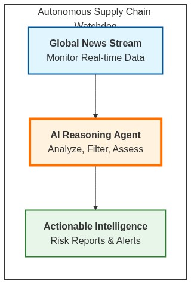
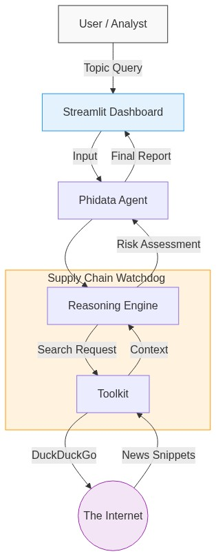
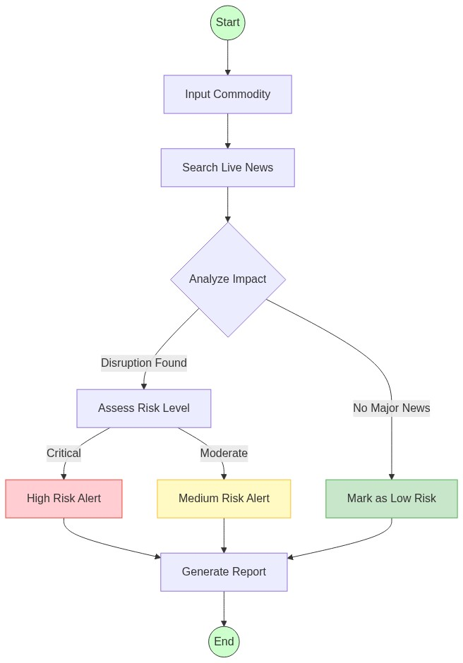
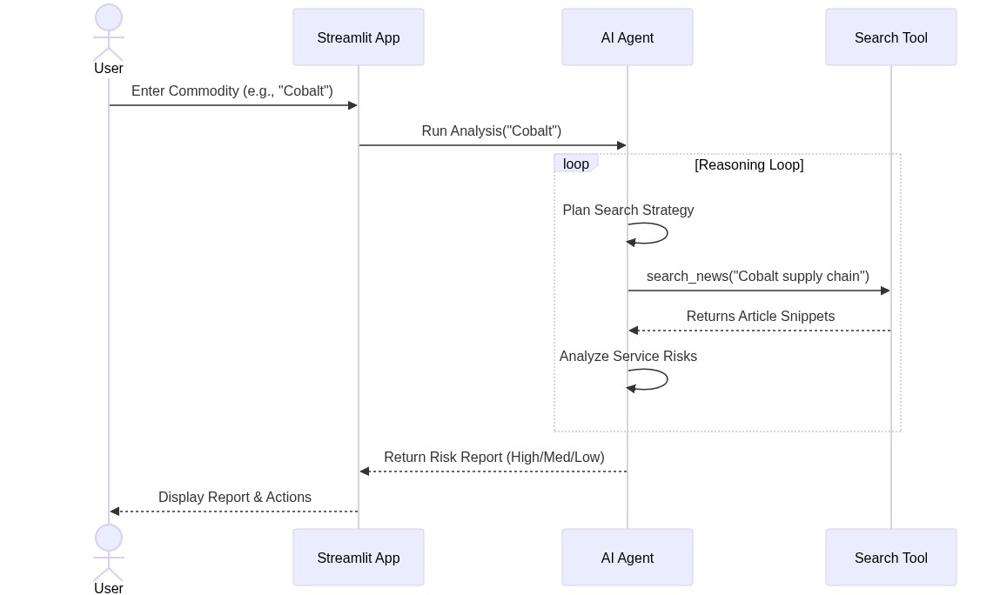

# Autonomous Supply Chain Watchdog 📦🔍 (Experimental PoC)



> **Disclaimer**: This project is an experimental Proof of Concept (PoC) demonstrating the use of AI Agents for supply chain risk analysis. It is not intended for production use.

## 📖 Overview

The **Autonomous Supply Chain Watchdog** is an AI-powered system designed to monitor, analyze, and assess supply chain risks in real-time. By leveraging **LLMs (Large Language Models)** and **autonomous agents**, it scans global news for disruptions—ranging from geopolitical tensions to raw material shortages—and provides actionable intelligence.

This project was built to demonstrate how **Reasoning Agents** can be applied to solve real-world business problems.

## 🏗️ Architecture

The system uses a **Phidata** agent at its core, orchestrating search tools and reasoning logic to deliver structured risk assessments.



### Key Components
- **Agent Framework**: [Phidata](https://github.com/phidatahq/phidata) for agent orchestration.
- **LLM**: OpenAI GPT-4o for reasoning and synthesis.
- **Tools**: DuckDuckGo Search for real-time information retrieval.
- **UI**: Streamlit for the interactive dashboard.

## 🚀 Workflow



1. **Input**: User queries a commodity (e.g., "Lithium") or company.
2. **Search**: The Agent autonomously searches for recent, high-impact news.
3. **Reasoning**: It filters noise, analyzes sentiment, and categorizes risk (Low/Medium/High).
4. **Report**: Generates a structured markdown report with actionable advice.

## 🛠️ Installation

```bash
# Clone the repository
git clone https://github.com/YOUR_USERNAME/autonomous-supply-chain-watchdog.git
cd autonomous-supply-chain-watchdog

# Create a virtual environment
python -m venv venv
source venv/bin/activate  # On Windows: venv\Scripts\activate

# Install dependencies
pip install -r requirements.txt
```

## 🏃‍♂️ Usage

1. Set up your environment variables:
   ```bash
   cp .env.example .env
   # Add your OPENAI_API_KEY
   ```

2. Run the Streamlit app:
   ```bash
   streamlit run app.py
   ```

3. Enter a commodity in the sidebar and click **Analyze Risks**.

## 🧠 Agent Logic

The core logic resides in `agent.py`. The agent is instructed to act as a "Supply Chain Risk Analyst" and follows a strict reasoning loop:
1. **Identify** key entities in the user query.
2. **Search** for "shortages", "delays", "price surges", and "geopolitical impact".
3. **Evaluate** credibility of sources.
4. **Synthesize** findings into a final risk score.



## 📄 License

MIT License. Free for educational and experimental use.

---
*Built as part of an experimental series on Applied AI Agents.*
